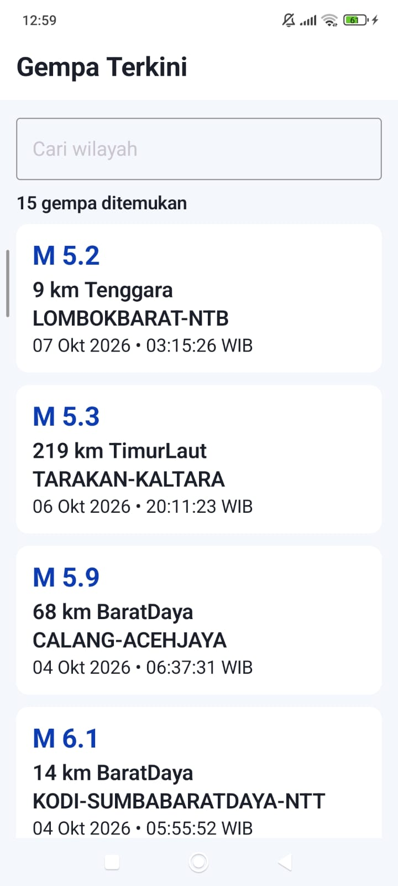
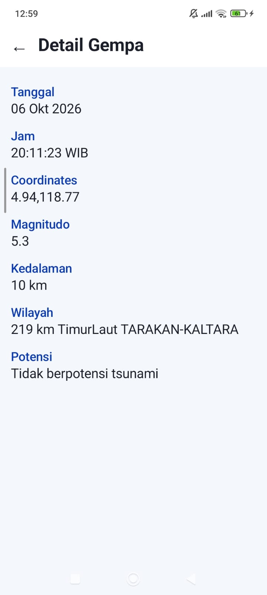

# BMKG Earthquake Catalog & Monitoring

Aplikasi mobile untuk menampilkan informasi gempa terkini dari BMKG secara dinamis melalui REST API.

Aplikasi dikembangkan menggunakan Kotlin dan Jetpack Compose dengan menerapkan arsitektur MVVM, Retrofit, StateFlow, dan Material Design 3.

---

## Video
Video Penjelasan Kode (YouTube): https://youtu.be/cp-aSko6ewk

## Lokasi APK Debug
C:\Users\VICTUS\AndroidStudioProjects\BMKG\app\build\outputs\apk\androidTest\debug\app-debug-androidTest.apk

## Screenshot

### Home Screen

Home Screen menampilkan daftar gempa terkini dari API BMKG serta fitur pencarian berdasarkan wilayah.



### Detail Screen

Detail Screen menampilkan informasi lengkap dari gempa yang dipilih.



---

## Fitur

### 1. Daftar Gempa Terkini
Menampilkan data gempa terkini dari BMKG dalam bentuk daftar.

Informasi yang ditampilkan:
- Tanggal
- Jam
- Magnitudo
- Wilayah

### 2. Pencarian Gempa
Pengguna dapat mencari gempa berdasarkan wilayah. Pencarian dilakukan secara lokal terhadap data yang telah diperoleh dari API BMKG.

### 3. Detail Gempa
Pengguna dapat memilih salah satu gempa untuk melihat:
- Tanggal
- Jam
- Coordinates
- Magnitudo
- Kedalaman
- Wilayah
- Potensi

### 4. Loading State
Menampilkan kondisi loading ketika aplikasi sedang mengambil data dari API.

### 5. Error State
Menampilkan pesan error apabila terjadi kegagalan dalam mengambil data dari API.

### 6. Light & Dark Theme
Aplikasi mendukung Light Theme dan Dark Theme menggunakan custom Material 3 Color Scheme dan Typography.

### 7. Navigasi
Aplikasi memiliki dua screen:
- Home Screen
- Detail Screen

Pengguna dapat berpindah dari Home ke Detail dan kembali menggunakan tombol Back.

---

## Architecture

Aplikasi menggunakan arsitektur **MVVM (Model-View-ViewModel)** dengan Repository Pattern.

```text
┌──────────────────────┐
│   Home / Detail      │
│      Compose UI      │
└──────────┬───────────┘
           │
           ▼
┌──────────────────────┐
│    GempaViewModel    │
│      StateFlow       │
└──────────┬───────────┘
           │
           ▼
┌──────────────────────┐
│   GempaRepository    │
└──────────┬───────────┘
           │
           ▼
┌──────────────────────┐
│      ApiService      │
│       Retrofit       │
└──────────┬───────────┘
           │
           ▼
┌──────────────────────┐
│       BMKG API       │
└──────────────────────┘
```

### Komponen

**View / Composable**
- `HomeScreen`
- `DetailScreen`
- `GempaItem`
- `DetailRow`

**ViewModel**

`GempaViewModel` mengelola proses pengambilan data dan state UI menggunakan `StateFlow`.

**Repository**

`GempaRepository` menjadi perantara antara ViewModel dan API Service.

**API Service**

`ApiService` mendefinisikan endpoint BMKG menggunakan Retrofit.

**Data Model**
- `Gempa`
- `GempaResponse`
- `Infogempa`

**UI State**

Menggunakan sealed class `UiState`:
- `Loading`
- `Success`
- `Error`

---

## API

Aplikasi menggunakan REST API BMKG tanpa API Key.

### Base URL

```text
https://data.bmkg.go.id/
```

### Endpoint

```text
DataMKG/TEWS/gempaterkini.json
```

### Full URL

```text
https://data.bmkg.go.id/DataMKG/TEWS/gempaterkini.json
```

### Data yang digunakan

Response API memiliki struktur:

```text
Infogempa
└── gempa[]
```

Data yang digunakan:
- Tanggal
- Jam
- Coordinates
- Magnitude
- Kedalaman
- Wilayah
- Potensi

Networking menggunakan Retrofit dengan Gson Converter untuk memproses response JSON dari API BMKG.

---

## Technical

### Programming Language
- Kotlin

### UI
- Jetpack Compose
- Material Design 3
- Scaffold
- TopAppBar
- LazyColumn
- Card
- Reusable Composable

### Architecture
- MVVM
- Repository Pattern
- ViewModel
- StateFlow
- Sealed UI State

### Networking
- Retrofit
- Gson Converter

### Navigation
- Navigation Compose

### State & Recomposition
- Compose State
- `rememberSaveable`
- `StateFlow`
- State-driven UI
- Local filtering berdasarkan wilayah

### Theme
Custom Material 3 Theme dengan:
- `Color.kt`
- `Theme.kt`
- `Type.kt`
- Light Color Scheme
- Dark Color Scheme
- Custom Typography

### Internet Permission

```xml
<uses-permission android:name="android.permission.INTERNET" />
```

---

## Project Structure

```text
com.pemob.bmkg
│
├── model
│   ├── Gempa.kt
│   └── GempaResponse.kt
│
├── network
│   ├── ApiService.kt
│   └── RetrofitInstance.kt
│
├── repository
│   └── GempaRepository.kt
│
├── ui
│   ├── home
│   │   ├── HomeScreen.kt
│   │   └── GempaItem.kt
│   │
│   ├── detail
│   │   └── DetailScreen.kt
│   │
│   └── theme
│       ├── Color.kt
│       ├── Theme.kt
│       └── Type.kt
│
├── uiState
│   └── UiState.kt
│
└── viewmodel
    ├── GempaViewModel.kt
    └── GempaViewModelFactory.kt
```

---

## Teknologi yang Digunakan

| Teknologi | Penggunaan |
|---|---|
| Kotlin | Bahasa pemrograman |
| Jetpack Compose | User Interface |
| Material 3 | Design System |
| Retrofit | Networking |
| Gson Converter | Parsing JSON |
| Navigation Compose | Navigasi screen |
| ViewModel | Pengelolaan UI state |
| StateFlow | Reactive state management |
| BMKG REST API | Sumber data gempa |

---

## Data Source

Data gempa diperoleh dari **Badan Meteorologi, Klimatologi, dan Geofisika (BMKG)** melalui REST API.

```text
https://data.bmkg.go.id/DataMKG/TEWS/gempaterkini.json
```
